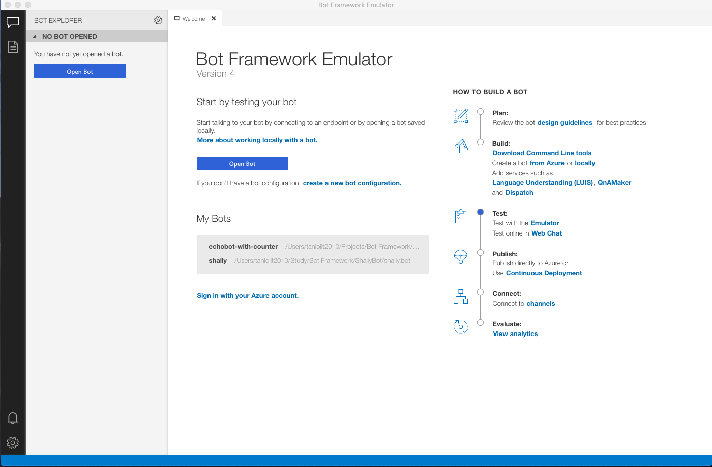
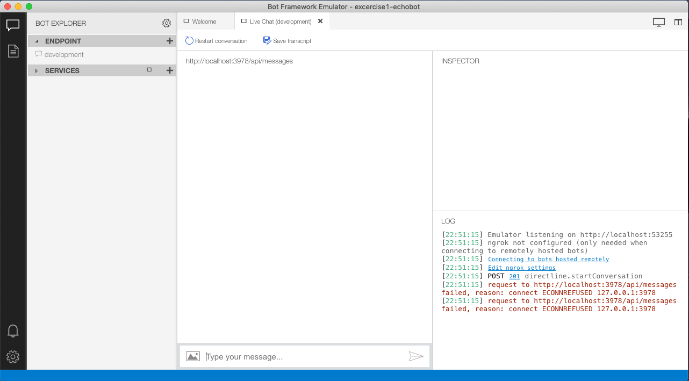
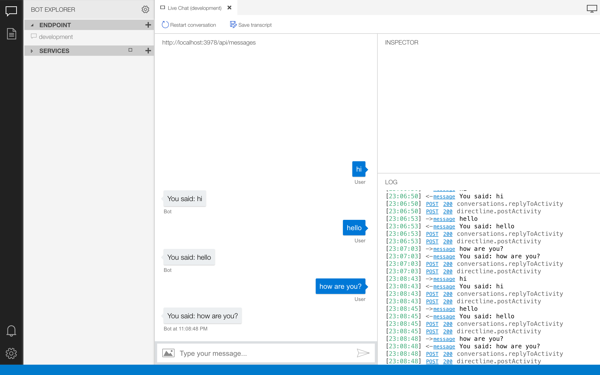

# Challenge 1: Creating Your First "Echo" Bot with the Bot Builder SDK v4 for .NET

## Introduction

This challenge will show you how to build a echo bot by using the [Bot Builder SDK for .NET v4](https://github.com/Microsoft/BotBuilder) and then test it with the Bot Framework Emulator v4.

## Prerequisites

* [.NET Core SDK](https://dotnet.microsoft.com/download)
* [Visual Studio 2017 Community](https://www.visualstudio.com/downloads) or [Visual Studio Code](https://code.visualstudio.com/download)
* [Bot Framework Emulator](https://github.com/Microsoft/BotFramework-Emulator/wiki/Getting-Started), which is the client you will use for testing your bot
* Knowledge of ASP.Net Core and asynchronous programming in C#

## Task 1: Create a New Web App project

1. Begining by create a ASP.NET Core Empty project
     ```console
    mkdir MyFirstBot
    cd MyFirstBot
    dotnet new web
    ```

2. Then, you need to add some dependencies to use the Bot Framework feature:
   ```console
   dotnet add package Microsoft.Bot.Builder
   dotnet add package Microsoft.Bot.Builder.Integration.AspNet.Core
   dotnet add package Microsoft.Bot.Configuration
   dotnet add package Microsoft.Bot.Connector
   dotnet add package Microsoft.Bot.Schema
   ```

## Task 2: Configure Bot Project

1. Add *appsettings.json*, you can access [here](https://docs.microsoft.com/en-us/aspnet/core/fundamentals/configuration) to uderstand more about this configuration file:
    ```json
    {
        "botFilePath": "myfirstbot.bot",
        "botFileSecret": ""
    }
    ```
2. Add *myfirstbot.bot*
    ```json
    {
        "name": "MyFirstBot",
        "description": "",
        "services": [
            {
                "type": "endpoint",
                "id": "1",
                "name": "development",
                "appId": "",
                "appPassword": "",
                "endpoint": "http://localhost:3978/api/messages"
            }
        ],
        "padlock": "",
        "version": "2.0"
    }
    ```
    The .bot is the uniform place to define the list of services that your bot is using. On the other hands, this file also helps you test your bot with the emulator. You can access [here](https://docs.microsoft.com/en-us/azure/bot-service/bot-file-basics) to understand more about .bot file
3. Add *MyFirstBot.cs*
    ```csharp
    public class MyFirstBot : IBot
    {
        public async Task OnTurnAsync(ITurnContext turnContext, CancellationToken cancellationToken = default(CancellationToken))
        {
            if (turnContext.Activity.Type == ActivityTypes.Message) 
            {
                var responseMessage = string.IsNullOrEmpty(turnContext.Activity.Text) 
                                            ? "Hello" 
                                            : $"You said: {turnContext.Activity.Text}";

                await turnContext.SendActivityAsync(responseMessage);
            }
        }
    }
    ```
   This class represents a bot that processes incoming activities. For each user interaction, an instance of this class is created and the OnTurnAsync method is called.

4. In **StartUp.cs**
   * Configure app configuration
        ``` csharp
        public Startup(IHostingEnvironment env)
        {
            var builder = new ConfigurationBuilder()
                .SetBasePath(env.ContentRootPath)
                .AddJsonFile("appsettings.json", optional: true, reloadOnChange: true)
                .AddEnvironmentVariables();

            Configuration = builder.Build();
        }

        public IConfiguration Configuration { get; }
        ```    
    * In *ConfigureServices* method:
        ```csharp
        public void ConfigureServices(IServiceCollection services)
        {
            var botFilePath = Configuration.GetSection("botFilePath")?.Value;
            if (!File.Exists(botFilePath))
            {
                throw new FileNotFoundException($"The .bot configuration file was not found. botFilePath: {botFilePath}");
            }
            BotConfiguration botConfig = null;
            try
            {
                botConfig = BotConfiguration.Load(botFilePath ?? @".\echo-with-counter.bot", string.Empty);
            }
            catch
            {
                var msg = @"Error reading bot file.";
                throw new InvalidOperationException(msg);
            }

            services.AddSingleton(sp => botConfig);

            var service = botConfig.Services.FirstOrDefault(s => s.Type == "endpoint" && s.Name == "development");

            if (!(service is EndpointService endpointService))
            {
                throw new InvalidOperationException($"The .bot file does not contain an endpoint with name development.");
            }

            services.AddBot<MyFirstBot>(options =>
            {
                options.CredentialProvider = new SimpleCredentialProvider(endpointService.AppId, endpointService.AppPassword);

                options.OnTurnError = async (context, exception) =>
                {
                    await context.SendActivityAsync("Sorry, it looks like something went wrong.");
                };
            });
        }
        ```
    * In *Configure* method:
        ```csharp
        public void Configure(IApplicationBuilder app, IHostingEnvironment env)
        {
            app.UseDefaultFiles()
                .UseStaticFiles()
                .UseBotFramework();
        }
        ```

## Task 3: Test the Bot

1. Update *launchSettings.json* with applicationUrl http://localhost:{your_port}/, for example:
    ```json
    {
        "iisSettings": {
            "windowsAuthentication": false, 
            "anonymousAuthentication": true, 
            "iisExpress": {
            "applicationUrl": "http://localhost:3978/",
            "sslPort": 44355
            }
        },
        "profiles": {
                "IIS Express": {
                "commandName": "IISExpress",
                "launchBrowser": true,
                "environmentVariables": {
                    "ASPNETCORE_ENVIRONMENT": "Development"
                }
            },
                "MyFirstBot": {
                "commandName": "Project",
                "launchBrowser": true,
                "applicationUrl": "http://localhost:3978/",
                "environmentVariables": {
                    "ASPNETCORE_ENVIRONMENT": "Development"
                }
            }
        }
    }
    ```

    > **NOTE**
    The *applicationUrl* value is used in the *endpoint* value in *echobot.bot*
    ```json
    "services": [
        {
            "type": "endpoint",
            "id": "1",
            "name": "development",
            "appId": "",
            "appPassword": "",
            "endpoint": "http://localhost:3978/api/messages"
        }
    ],
    ```
2. Run your bot:
    ```consolem
    dotnet run
    ```

3. Open Bot Framework Emulator v4:  
    
   

4. Click **Open Bot** and select the *echo-bot.bot* file
   
   

5. Type something and get the response from our bot
   
   