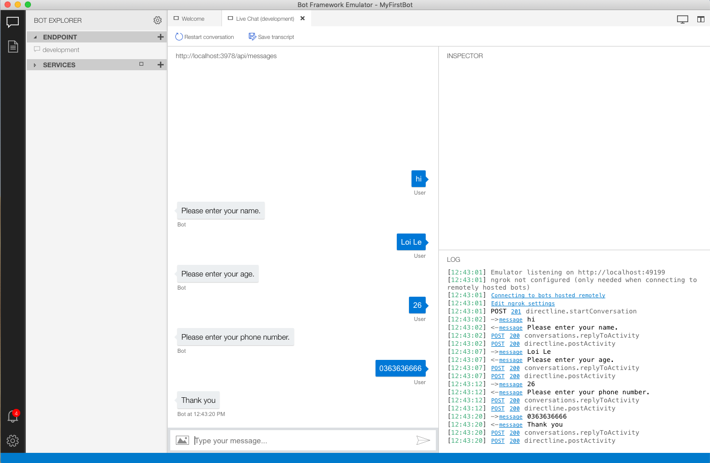

# Prompt users to get theỉr persional infomation

## Introduction

In this challenge, you will learn how to create a dialog and use prompt technique to get user infomation

## Prerequisites

* [.NET Core SDK](https://dotnet.microsoft.com/download)
* [Visual Studio 2017 Community](https://www.visualstudio.com/downloads) or [Visual Studio Code](https://code.visualstudio.com/download)
* [Bot Framework Emulator](https://github.com/Microsoft/BotFramework-Emulator/wiki/Getting-Started), which is the client you will use for testing your bot
* Knowledge of ASP.Net Core and asynchronous programming in C#

## Task 1: Add new dialog package

1. In order to work with dialog in Bot Framework, you need to add the below package:
     ```console
    dotnet add package Microsoft.Bot.Builder.Dialogs
    ```

## Task 2: Create the new Dialog: **WhoAreYou**

1. Create new class *WhoAreYouDialog.cs* to handle our dialog:
   
    ```csharp
    public class WhoAreYouDialog : ComponentDialog
    {
        public const string Name = "Who_are_you";

        public WhoAreYouDialog() : base(Name)
        {
        }
    }
    ```

2.  Add these read-only variables to your  *WhoAreYouDialog.cs*:
    ```csharp
    private string NamePrompt => "NamePrompt";

    private string AgePrompt => "AgePrompt";

    private string PhoneNumberPrompt => "PhoneNumberPrompt";

    private string dialogStart => "Who_are_you_start";
    ```

3. Define dialog steps in constructor:
    ```csharp
    public WhoAreYouDialog() : base(Name)
    {
        var waterfallSteps = new WaterfallStep[]
        {
            NameStepAsync,
            AgeStepAsync,
            PhoneNumberStepAsync,
            FinalStepAsync
        };

        AddDialog(new WaterfallDialog(
            dialogStart,
            waterfallSteps));

        AddDialog(new TextPrompt(NamePrompt));
        AddDialog(new NumberPrompt<int>(AgePrompt));
        AddDialog(new NumberPrompt<int>(PhoneNumberPrompt));
    }
    ```
    In the constructor, we define the list of step that the dialog include. For each step, we will ask (prompt) user a question. And we also set the expectation for the type of the answer info is text or number.

    Please continue to the next steps to define the step detail.

4. Define the first step: **Ask for name**
    ```csharp
    private async Task<DialogTurnResult> NameStepAsync(WaterfallStepContext stepContext, CancellationToken cancellationToken)
    {
        var opts = new PromptOptions
        {
            Prompt = new Activity
            {
                Type = ActivityTypes.Message,
                Text = "Please enter your name.",
            },
        };

        return await stepContext.PromptAsync(
            NamePrompt,
            opts);
    }
    ```

5. Define the second step: **Ask for age**
    ```csharp
    private async Task<DialogTurnResult> AgeStepAsync(
            WaterfallStepContext stepContext,
            CancellationToken cancellationToken)
    {
        return await stepContext.PromptAsync(
            AgePrompt,
            new PromptOptions { Prompt = MessageFactory.Text("Please enter your age.") },
            cancellationToken);
    }
    ```

6. Define the third step **Ask for phone number**
    ```csharp
    private async Task<DialogTurnResult> PhoneNumberStepAsync(
            WaterfallStepContext stepContext,
            CancellationToken cancellationToken)
    {
        return await stepContext.PromptAsync(
            PhoneNumberPrompt,
            new PromptOptions { Prompt = MessageFactory.Text("Please enter your phone number.") },
            cancellationToken);
    }
    ```

7. Add the final step
    ```csharp
    private async Task<DialogTurnResult> FinalStepAsync(
            WaterfallStepContext stepContext,
            CancellationToken cancellationToken)
    {
        return await stepContext.EndDialogAsync();
    }
    ```

## Task 3: Register the conversation state for dependency injection
    
* Add the snippet code below to the end of the *ConfigureServices* method in *Startup.cs*

    ```csharp
    IStorage dataStore = new MemoryStorage();
    var conversationState = new ConversationState(dataStore);
    services.AddSingleton(conversationState);
    ```

    We will discuss more about state in bot frameowrk in the next challenge. So please do not care about this at the time being.

## Task 4: Start the **WhoAreYou** dialog
1. In *MyFirstBot.cs*, register **WhoAreYou** to the dialogset:
   
    ```csharp
    private readonly DialogSet _dialogs;
    private readonly ConversationState _conversationState;
    private readonly IStatePropertyAccessor<DialogState> _dialogStateAccessor;

    public MyFirstBot(ConversationState conversationState)
    {
        _conversationState = conversationState ?? throw new ArgumentNullException(nameof(conversationState));

        _dialogStateAccessor = _conversationState.CreateProperty<DialogState>(nameof(DialogState));
        _dialogs = new DialogSet(_dialogStateAccessor);
        _dialogs.Add(new WhoAreYouDialog());
    }
    ```

2. Start **Who Are You** dialog:
   
    ```csharp
    public async Task OnTurnAsync(ITurnContext turnContext, CancellationToken cancellationToken = default(CancellationToken))
    {
        if (turnContext.Activity.Type == ActivityTypes.Message)
        {
            var dc = await _dialogs.CreateContextAsync(turnContext, cancellationToken);
            var dialogTurnResult = await dc.ContinueDialogAsync(cancellationToken);
            
            if (dialogTurnResult.Status is DialogTurnStatus.Empty)
            {
                await dc.BeginDialogAsync(WhoAreYouDialog.Name, null, cancellationToken);
            }
            else if (dialogTurnResult.Status is DialogTurnStatus.Complete) 
            {
                await turnContext.SendActivityAsync("Thank you");
            }
        }
        

        await _conversationState.SaveChangesAsync(turnContext);
    }
    ```

    The *dialogTurnResult.Status* show us the status of the dialog: the dialog is not started (Empty), or we are in the middle of the dialog or the dialog is completed.

    The stamemnt to start the new dialog:
    ```csharp
    await dc.BeginDialogAsync(WhoAreYouDialog.Name, null, cancellationToken);
    ```
## Task 5: Test the Bot
1. Run your bot
   ```console
   dotnet run
   ```
2. Test your bot with bot emulator
   
