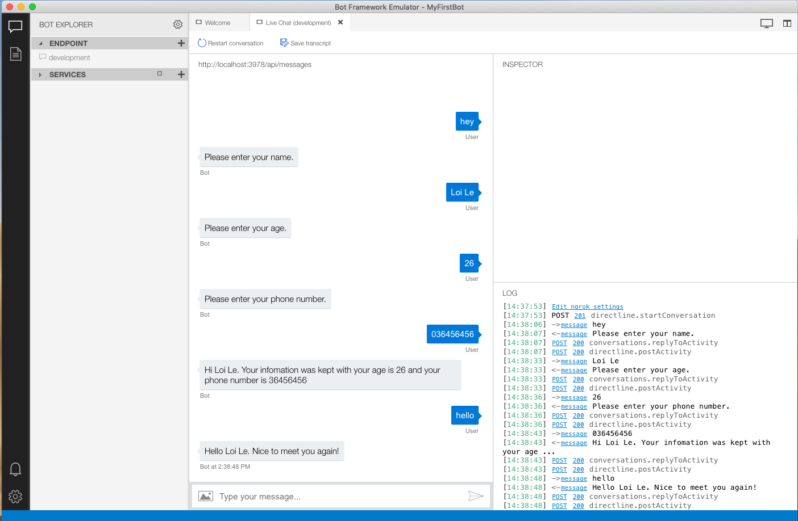

# Challenge 3: The Bot who could not forget

## Introduction
After finishing the last challenge (challenge 3), we have the bot that whenever you interact with, it will ask for your infomation. Honestly, that is not a smart bot. In order to build a smarter bot, your need to let your bot remember certain things about a user or conversation that it asked user before.

In this challenge we will learn the way to do that with state management in Bot Framework.

## Prerequisites

* [.NET Core SDK](https://dotnet.microsoft.com/download)
* [Visual Studio 2017 Community](https://www.visualstudio.com/downloads) or [Visual Studio Code](https://code.visualstudio.com/download)
* [Bot Framework Emulator](https://github.com/Microsoft/BotFramework-Emulator/wiki/Getting-Started), which is the client you will use for testing your bot
* Knowledge of ASP.Net Core and asynchronous programming in C#

## Task 1: 

1. First of all, we defind the *Models/UserProfile.cs* to store personal info of the user
    ```csharp
    public class UserProfile
    {
        public string Name { get; set; }

        public int Age { get; set; }

        public string PhoneNumber { get; set; }
    }
    ```

2. Inject *_userState* and *_userProfileAccessor* to the **WhoAreYouDialog**
    ```csharp
    private readonly UserState _userState;

    private readonly IStatePropertyAccessor<UserProfile> _userProfileAccessor;

    public WhoAreYouDialog(UserState userState, IStatePropertyAccessor<UserProfile> userProfileAccessor) : base(Name)
    {
        this._userState = userState;
        this._userProfileAccessor = userProfileAccessor;
        
        // ...
    }
    ```

3. In *WhoAreYouDialog.cs*, step 1 *NameStepAsync*, we instance a UserInfo
   ```csharp
   private async Task<DialogTurnResult> NameStepAsync(WaterfallStepContext stepContext, CancellationToken   cancellationToken)
    {
        stepContext.Values["UserInfo"] = new UserProfile();
        
        return await stepContext.PromptAsync(
            NamePrompt,
            new PromptOptions { Prompt = MessageFactory.Text("Please enter your name.") },
            cancellationToken);
    }
   ```

4. In step 2 *AgeStepAsync*, we store the user name from user response to the UserInfo that was instanced from last step
   
    ```csharp
    private async Task<DialogTurnResult> AgeStepAsync(
            WaterfallStepContext stepContext,
            CancellationToken cancellationToken)
    {
        var name = (string)stepContext.Result;
        ((UserProfile)stepContext.Values["UserInfo"]).Name = name;
        
        return await stepContext.PromptAsync(
            AgePrompt,
            new PromptOptions { Prompt = MessageFactory.Text("Please enter your age.") },
            cancellationToken);
    }
    ```
5. ... and we store the age in the step 3 *PhoneNumberStepAsync*
   
   ```csharp
   private async Task<DialogTurnResult> PhoneNumberStepAsync(
            WaterfallStepContext stepContext,
            CancellationToken cancellationToken)
    {
        var age = (int)stepContext.Result;
        ((UserProfile)stepContext.Values["UserInfo"]).Age = age;

        return await stepContext.PromptAsync(
            PhoneNumberPrompt,
            new PromptOptions { Prompt = MessageFactory.Text("Please enter your phone number.") },
            cancellationToken);
    }
   ```

6. ... save user information to the user state in the final step, then return the UserInfo when ending the dialog
   
    ```csharp
    private async Task<DialogTurnResult> FinalStepAsync(
            WaterfallStepContext stepContext,
            CancellationToken cancellationToken)
    {
        var userProfile = ((UserProfile)stepContext.Values["UserInfo"]);
        var phoneNumber = stepContext.Result.ToString();
        userProfile.PhoneNumber = phoneNumber;

        await _userProfileAccessor.SetAsync(stepContext.Context, userProfile, cancellationToken);
        await _userState.SaveChangesAsync(stepContext.Context, false, cancellationToken);

        await stepContext.Context.SendActivityAsync("Thank you.");

        return await stepContext.EndDialogAsync(stepContext.Values["UserInfo"]);
    }
    ```

## Task 2:
1. Add the snippet code below to the end of the *ConfigureServices* method in *Startup.cs*

    ```csharp
    var userState = new UserState(dataStore);
    services.AddSingleton(userState);
    ```
2. In *MyFirstBot.cs*, create the **UserProfile** property for the user state
   
    ```csharp
    private readonly DialogSet _dialogs;
    private readonly ConversationState _conversationState;
    private readonly IStatePropertyAccessor<DialogState> _dialogStateAccessor;
    private readonly UserState _userState;
    private readonly IStatePropertyAccessor<UserProfile> _userProfileAccessor;

    public MyFirstBot(ConversationState conversationState, UserState userstate)
    {
        _conversationState = conversationState ?? throw new ArgumentNullException(nameof(conversationState));
        _userState = userstate ?? throw new ArgumentNullException(nameof(userstate));

        _dialogStateAccessor = _conversationState.CreateProperty<DialogState>(nameof(DialogState));
        _userProfileAccessor = _userState.CreateProperty<UserProfile>(nameof(UserProfile));

        _dialogs = new DialogSet(_dialogStateAccessor);
        _dialogs.Add(new WhoAreYouDialog(_userState, _userProfileAccessor));
    }
    ```

3. Update the *OnTurnAsync*
   
    ```csharp
    public async Task OnTurnAsync(ITurnContext turnContext, CancellationToken cancellationToken = default(CancellationToken))
    {
        if (turnContext.Activity.Type == ActivityTypes.Message)
        {
            var dc = await _dialogs.CreateContextAsync(turnContext, cancellationToken);
            var dialogTurnResult = await dc.ContinueDialogAsync(cancellationToken);

            UserProfile userProfile = await _userProfileAccessor.GetAsync(turnContext, () => null, cancellationToken);

            if (dialogTurnResult.Status is DialogTurnStatus.Empty)
            {
                if (userProfile is null)
                {
                    await _userProfileAccessor.SetAsync(turnContext, new UserProfile(), cancellationToken);
                    await _userState.SaveChangesAsync(turnContext, false, cancellationToken);
                    await dc.BeginDialogAsync(WhoAreYouDialog.Name, null, cancellationToken);
                }
                else 
                {
                    await turnContext.SendActivityAsync($"Hello {userProfile.Name}. Nice to meet you again!");
                }
            }
        }


        await _conversationState.SaveChangesAsync(turnContext);
    }
     ```

    * Instance the empty user profile before beginning the dialog
        ```csharp
        await _userProfileAccessor.SetAsync(turnContext, new UserProfile(), cancellationToken);
        await _userState.SaveChangesAsync(turnContext, false, cancellationToken);
        await dc.BeginDialogAsync(WhoAreYouDialog.Name, null, cancellationToken);
        ```
    * If the user profile was kept, no need to ask user again
        ```csharp
        if (userProfile is null) 
        {
            // begin dialog
        }
        else 
        {
            await turnContext.SendActivityAsync($"Hello {userProfile.Name}. Nice to meet you again!");
        }
        ```
    
## Task 3: Test the bot
1. Run your bot
    ```console
    dotnet run
    ```
2. Test your bot with bot emulator
   
   