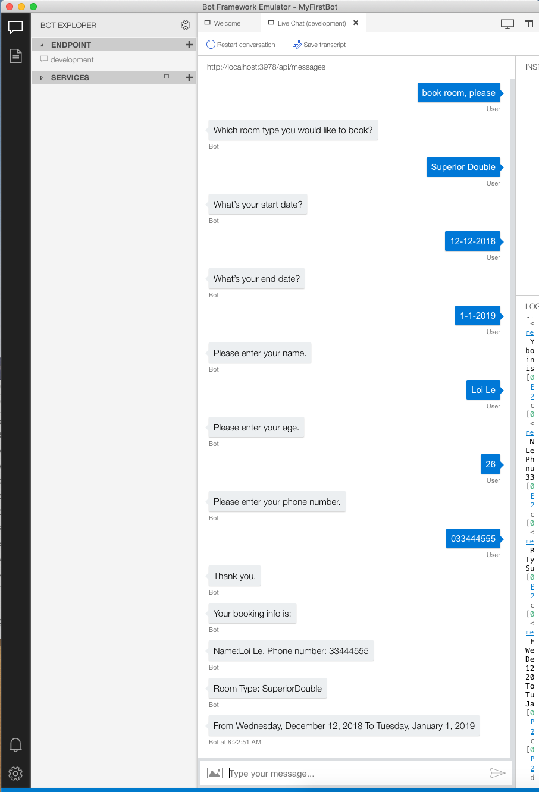
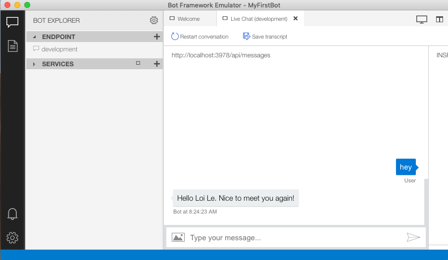

# Challenge 3: The Bot understand human language

## Introduction

The bot often handle multiple of tasks. Therefore, it should be have the multiple of dialog in the bot. So, we will add new new dialog to help user book the hotel room with our bot.

Further more, in this challenge, we will add new a dialog and learn the technique that start a dialog inside another dialog.

## Prerequisites

* [.NET Core SDK](https://dotnet.microsoft.com/download)
* [Visual Studio 2017 Community](https://www.visualstudio.com/downloads) or [Visual Studio Code](https://code.visualstudio.com/download)
* [Bot Framework Emulator](https://github.com/Microsoft/BotFramework-Emulator/wiki/Getting-Started), which is the client you will use for testing your bot
* Knowledge of ASP.Net Core and asynchronous programming in C#

## Task 1: 
1. Add new model *Models/HotelBookingInfo.cs*
    ```csharp
    public class HotelBookingInfo
    {
        public DateTime StartDate { get; set; }

        public DateTime EndDate { get; set; }
        
        public UserProfile UserInfo { get; set; }
        
        public RoomType RoomType { get; set; }
    }

    public enum RoomType 
    {
        RitzySuite = 0,
        SuperiorDouble = 1,
        DeluxeTwin = 2
    }
   ```

2. Add new class *Dialogs/BookHotelDialog.cs*
    ```csharp
    public class BookHotelDialog : ComponentDialog
    {
        public const string Name = "book_hotel";

        private string dialogStart => "hotel_booking_start";

        private string RoomTypePrompt => "RoomTypePrompt";

        private string StartDatePrompt => "StartDatePrompt";

        private string EndDatePrompt => "EndDatePrompt";

        private readonly IStatePropertyAccessor<UserProfile> _userProfileAccessor;

        private readonly UserState _userState;


        public BookHotelDialog(UserState userState, IStatePropertyAccessor<UserProfile> userProfileAccessor) : base(Name)
        {
            _userState = userState;
            _userProfileAccessor = userProfileAccessor;

            var waterfallSteps = new WaterfallStep[]
            {
                RoomTypeStepAsync,
                StartDateStepAsync,
                EndDateStepAsync,
                UserInfoStepAsync,
                FinalStepAsync
            };

            AddDialog(new WaterfallDialog(
               dialogStart,
               waterfallSteps));

            AddDialog(new ChoicePrompt(RoomTypePrompt));
            AddDialog(new DateTimePrompt(StartDatePrompt));
            AddDialog(new DateTimePrompt(EndDatePrompt));
            AddDialog(new WhoAreYouDialog(_userState, _userProfileAccessor));
        }

        private async Task<DialogTurnResult> RoomTypeStepAsync(WaterfallStepContext stepContext, CancellationToken cancellationToken)
        {
            stepContext.Values["BookingInfo"] = new HotelBookingInfo();

            return await stepContext.PromptAsync(
                RoomTypePrompt,
                new PromptOptions
                {
                    Prompt = MessageFactory.Text("Which room type you would like to book?"),
                    RetryPrompt = MessageFactory.Text("Sorry, please choose a location from the list."),
                    Choices = ChoiceFactory.ToChoices(new List<string> { "Ritzy Suite", "Superior Double", "Deluxe Twin" }),
                },
                cancellationToken);
        }

        private async Task<DialogTurnResult> StartDateStepAsync(WaterfallStepContext stepContext, CancellationToken cancellationToken)
        {
            ((HotelBookingInfo)stepContext.Values["BookingInfo"]).RoomType = this.GetRoomType(((FoundChoice)stepContext.Result).Value) ?? throw new InvalidOperationException("The room type is invalid");

            return await stepContext.PromptAsync(
                StartDatePrompt,
                new PromptOptions 
                { 
                    Prompt = MessageFactory.Text("What's your start date?"),
                    RetryPrompt = MessageFactory.Text("Sorry, please choose a location from the list.")
                },
                cancellationToken);
        }

        private async Task<DialogTurnResult> EndDateStepAsync(WaterfallStepContext stepContext, CancellationToken cancellationToken)
        {
            var result = stepContext.Result as IEnumerable<DateTimeResolution>;
            ((HotelBookingInfo)stepContext.Values["BookingInfo"]).StartDate = DateTime.Parse(result.First().Value);

            return await stepContext.PromptAsync(
                EndDatePrompt,
                new PromptOptions { Prompt = MessageFactory.Text("What's your end date?") },
                cancellationToken);
        }

        private async Task<DialogTurnResult> UserInfoStepAsync(WaterfallStepContext stepContext, CancellationToken cancellationToken)
        {
            var result = stepContext.Result as IEnumerable<DateTimeResolution>;
            ((HotelBookingInfo)stepContext.Values["BookingInfo"]).EndDate = DateTime.Parse(result.First().Value);

            var userInfo = await _userProfileAccessor.GetAsync(stepContext.Context, () => null, cancellationToken);

            if (userInfo is null) {
                return await stepContext.BeginDialogAsync(WhoAreYouDialog.Name, null, cancellationToken);
            }
            else 
            {
                return await stepContext.NextAsync(userInfo);
            }
        }

        private async Task<DialogTurnResult> FinalStepAsync(
            WaterfallStepContext stepContext,
            CancellationToken cancellationToken)
        {
            var bookingInfo = (HotelBookingInfo)stepContext.Values["BookingInfo"];   
            bookingInfo.UserInfo = (UserProfile)stepContext.Result;

            await stepContext.Context.SendActivityAsync($"Your booking info is:");
            await stepContext.Context.SendActivityAsync($"Name:{bookingInfo.UserInfo.Name}. Phone number: {bookingInfo.UserInfo.PhoneNumber}");
            await stepContext.Context.SendActivityAsync($"Room Type: {bookingInfo.RoomType}");
            await stepContext.Context.SendActivityAsync($"From {bookingInfo.StartDate.ToLongDateString()} To {bookingInfo.EndDate.ToLongDateString()}");

            return await stepContext.EndDialogAsync(bookingInfo);
        }

        private RoomType? GetRoomType(string result)
        {
            switch (result) 
            {
                case "Ritzy Suite":
                    return RoomType.RitzySuite;
                case "Superior Double":
                    return RoomType.SuperiorDouble;
                case "Deluxe Twin":
                    return RoomType.DeluxeTwin;
                default:
                    return null;
            }
        }
    }
    ```

    * In the case that we have not yet asked for user information, we begin the new **WhoAreYou** dialog.
        ```csharp
        // ...
        if (userInfo is null) {
            return await stepContext.BeginDialogAsync(WhoAreYouDialog.Name, null, cancellationToken);
        }
        else 
        {
            return await stepContext.NextAsync(userInfo);
        }
        //...
        ```

3. In *MyFirstBot.cs*:
    1. Add the **BookHotelDialog** in the constructor:
        ```csharp
        public MyFirstBot(ConversationState conversationState, UserState userstate)
        {
            //...

            _dialogs = new DialogSet(_dialogStateAccessor);
            _dialogs.Add(new BookHotelDialog(_userState, _userProfileAccessor));
            _dialogs.Add(new WhoAreYouDialog(_userState, _userProfileAccessor));
        }
        ```
    
    2.  **OnTurnAsync** method:
        ```csharp
        public async Task OnTurnAsync(ITurnContext turnContext, CancellationToken cancellationToken = default(CancellationToken))
        {
            if (turnContext.Activity.Type == ActivityTypes.Message)
            {
                var dc = await _dialogs.CreateContextAsync(turnContext, cancellationToken);
                var dialogTurnResult = await dc.ContinueDialogAsync(cancellationToken);

                UserProfile userProfile = await _userProfileAccessor.GetAsync(turnContext, () => null, cancellationToken);

                if (dialogTurnResult.Status is DialogTurnStatus.Empty)
                {
                    var text = turnContext.Activity.Text.ToLower();

                    switch(text) 
                    {
                        case "hi":
                        case "hello":
                        case "hey":
                            if (userProfile is null)
                            {
                                await dc.BeginDialogAsync(WhoAreYouDialog.Name, null, cancellationToken);
                            }
                            else
                            {
                                await turnContext.SendActivityAsync($"Hello {userProfile.Name}. Nice to meet you again!");
                            }

                            break;
                        case "I would like to book a room":
                        case "book room, please":
                            await dc.BeginDialogAsync(BookHotelDialog.Name, null, cancellationToken);
                            break;
                        default:
                            await dc.Context.SendActivityAsync("I didn't understand what you just said to me.");
                            break;
                    }
                }
            }

            await _conversationState.SaveChangesAsync(turnContext);
        }
        ```

        * Base on the user input, we decide which the dialog should be started:
            ```csharp
            //...
            var text = turnContext.Activity.Text.ToLower();

            switch(text) 
            {
                case "hi":
                case "hello":
                case "hey":
                    if (userProfile is null)
                    {
                        await dc.BeginDialogAsync(WhoAreYouDialog.Name, null, cancellationToken);
                    }
                    else
                    {
                        await turnContext.SendActivityAsync($"Hello {userProfile.Name}. Nice to meet you again!");
                    }

                    break;
                case "I would like to book a room":
                case "book room, please":
                    await dc.BeginDialogAsync(BookHotelDialog.Name, null, cancellationToken);
                    break;
                default:
                    await dc.Context.SendActivityAsync("I didn't understand what you just said to me.");
                    break;
            }

            //...
            ```

## Task 2: Test the bot
1. Run your bot
    ```console
    dotnet run
    ```
2. Test your bot with bot emulator
   
   

   
   