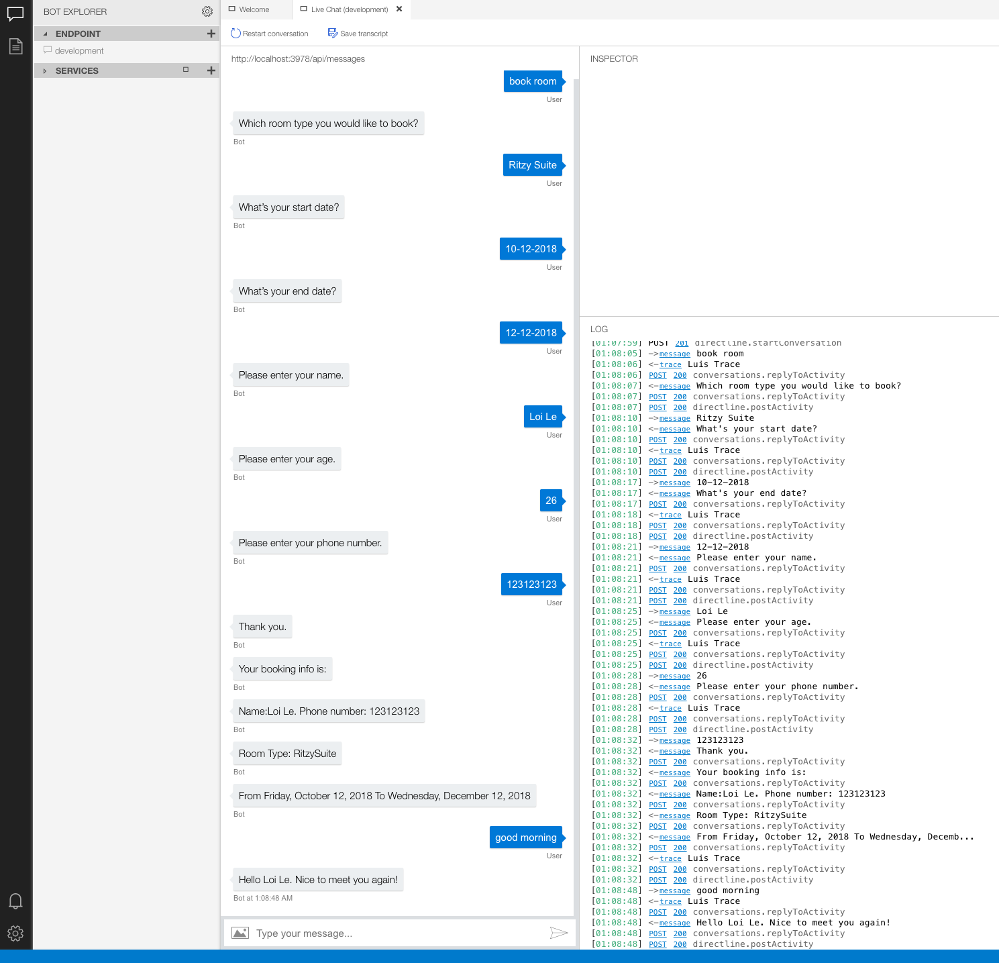

# Challenge 3: Add Book Hotel Dialog

## Introduction

In the previous challenge, we decide what dialog should be start based on user message. This is not a efficent way because user can input anything and we can not handle all of the cases.

Therefore, it would be great if your bot can understand what user means, but it's not a simple task. Fortunately, Microsoft provide us the [LUIS](luis.ai), the Language Understanding, help the bot to recognize the intent of user messages and more natural conversation feel.

Throughout this challenge, you will learn the way to use LUIS in your bot project.

## Prerequisites

* LUIS.ai account
* Bot Framework Emulator
* Knowledge of bot basics, natural language processing, and .bot file.

## Task 1: Create a LUIS app in the LUIS portal 
1. Sign in to the LUIS portal to create your own version of the sample LUIS app. You can create and manage your applications on My Apps.

    1. Select Import new app.
    2. Click Choose App file (JSON format)...
    3. Select [HotelBot.json](./assets/luis/HotelBot.json)
    4. Train the app.
    5. Publish the app to production environment.
2. Obtain values to connect to your LUIS app  
   Retrieve application information from the LUIS.ai portal
    1. Select your published LUIS app from luis.ai.
    2. With your published LUIS app open, select the MANAGE tab.
    3. Select the Application Information tab on the left side, record the value shown for Application ID as <YOUR_APP_ID>.
    4. Select the Keys and Endpoints tab on the left side, record the value shown for Authoring Key as <YOUR_AUTHORING_KEY>. Note that your subscription key is the same as your authoring key.
    5. Scroll down to the end of the page, record the value shown for Region as <YOUR_REGION>.
    6. Record the value shown for Endpoint as <YOUR_ENDPOINT>.
3. Update the bot file  
    * Add the information required to access your LUIS app including application id, authoring key, subscription key, endpoint and region into the *myfirstbot.bot* file. These are the values you saved previously from your published LUIS app.

        ```json
        {
            "name": "MyFirstBot",
            "description": "",
            "services": [
                {
                    "type": "endpoint",
                    "id": "1",
                    "name": "development",
                    "appId": "",
                    "appPassword": "",
                    "endpoint": "http://localhost:3978/api/messages"
                },
                {
                    "type": "luis",
                    "name": "LuisBot",
                    "appId": "8aa183f3-c8f8-4dd2-80d8-e55fc8e2819a",
                    "version": "0.1",
                    "authoringKey": "576b1db2b30340a791084eaf58f638b1",
                    "subscriptionKey": "576b1db2b30340a791084eaf58f638b1",
                    "region": "westus",
                    "id": "158"
                }
            ],
            "padlock": "",
            "version": "2.0"
        }
        ```
## Task 2: 
1. Install LUIS package:
    ```console
    dotnet add package Microsoft.Bot.Builder.AI.Luis
    ```
2. Add new class *BotServices.cs*
    ```csharp
    public class BotServices
    {
        public BotServices(BotConfiguration botConfiguration)
        {
            foreach (var service in botConfiguration.Services)
            {
                switch (service.Type)
                {
                    case ServiceTypes.Luis:
                    {
                        var luis = (LuisService)service;
                        if (luis == null)
                        {
                            throw new InvalidOperationException("The LUIS service is not configured correctly in your '.bot' file.");
                        }

                        var app = new LuisApplication(luis.AppId, luis.AuthoringKey, luis.GetEndpoint());
                        var recognizer = new LuisRecognizer(app);
                        this.LuisServices.Add(luis.Name, recognizer);
                        break;
                        }
                    }
                }
            }

        public Dictionary<string, LuisRecognizer> LuisServices { get; } = new Dictionary<string, LuisRecognizer>();
    }
    ```

    This class help to handle create the Luis serivice instance by loading infor from .bot file. In case that the Luis Service is not defined in the .bot file, the exception will be thrown. 

2. Register DI:
    ```csharp
    //...
    services.AddSingleton(sp => new BotServices(botConfig));
    services.AddSingleton(sp => botConfig);
    //...
    ```
3. In *MyFirstBot.cs*, define **BotService** instance and some constant:
    ```csharp
    private readonly BotServices _services;

    private static readonly string LuisConfiguration = "LuisBot";

    private const string GreetingIntent = "greeting";

    private const string BookingIntent = "booking";

    private const string NoneIntent = "None";
    ```
4. Inject **BotServices**:
    ```csharp
    public MyFirstBot(BotServices services, ConversationState conversationState, UserState userstate)
    {
        _services = services ?? throw new ArgumentNullException(nameof(services));

        //...
    }
    ```
5. Update *OnTurnAsync* method:
    ```csharp
    public async Task OnTurnAsync(ITurnContext turnContext, CancellationToken cancellationToken = default(CancellationToken))
    {
        if (turnContext.Activity.Type == ActivityTypes.Message)
        {
            var dc = await _dialogs.CreateContextAsync(turnContext, cancellationToken);
            var dialogTurnResult = await dc.ContinueDialogAsync(cancellationToken);

            UserProfile userProfile = await _userProfileAccessor.GetAsync(turnContext, () => null, cancellationToken);

            var luisResults = await _services.LuisServices[LuisConfiguration].RecognizeAsync(dc.Context, cancellationToken);
            var topScoringIntent = luisResults?.GetTopScoringIntent();
            var topIntent = topScoringIntent.Value.intent;

            if (dialogTurnResult.Status is DialogTurnStatus.Empty)
            {
                switch (topIntent)
                {
                    case GreetingIntent:
                        if (userProfile is null)
                        {
                            await dc.BeginDialogAsync(WhoAreYouDialog.Name, null, cancellationToken);
                        }
                        else
                        {
                            await turnContext.SendActivityAsync($"Hello {userProfile.Name}. Nice to meet you again!");
                        }

                        break;
                    case BookingIntent:
                        await dc.BeginDialogAsync(BookHotelDialog.Name, null, cancellationToken);
                        break;

                    case NoneIntent:
                    default:
                        await dc.Context.SendActivityAsync("I didn't understand what you just said to me.");
                        break;
                }
            }
        }


        await _conversationState.SaveChangesAsync(turnContext);
    }
    ```

    * The snippet code below help to detect the intent of the user message with LUIS service. And based on that, we decide which dialog should be start:

        ```csharp
            var luisResults = await _services.LuisServices[LuisConfiguration].RecognizeAsync(dc.Context, cancellationToken);
            var topScoringIntent = luisResults?.GetTopScoringIntent();
            var topIntent = topScoringIntent.Value.intent;
        ```

## Task 4: Test the bot
   